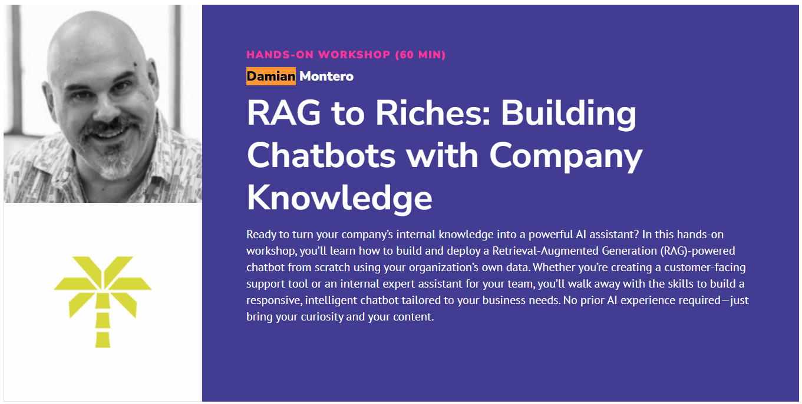

# RAG to Riches: Building Chatbots with Company Knowledge



## Presentation slides
- [Google Slides](https://docs.google.com/presentation/d/1KPNZQNOGFbohyAG-mlG-3FXlEK7KCp7rWTfxCwhW-aA/edit?usp=sharing)

## Projects
- Basic StreamLit - ```src/1-bvasicStreamLit.py```
- Basic LLM       - ```/2-basicllm.py```
- RAG with Text   - ```src/3.ragText.py```
- RAG with PDF    - ```src/4-ragPDF.py```
- RAG with Website - ```src/5-ragWebsite.py```

## How to run the projects:

first, install uv:
```curl -LsSf https://astral.sh/uv/install.sh | sh```

Then for each project:
```uv run streamlit run YOUR_PROJECT_SCRIPT```
